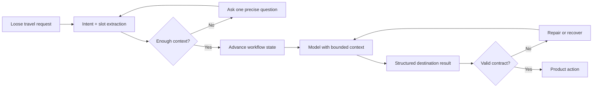
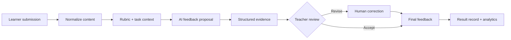

 

<strong>I turn ambiguous product problems into explicit systems:</strong> 
interfaces people can understand, state machines teams can reason about, and AI behavior that can be evaluated instead of merely demonstrated.

  

---

## The short version

I build end to end, but I do not think end to end means “touch every layer.” It means carrying one product decision all the way through the interface, application state, model contract, persistence and recovery path—without losing the reason it exists.

Most repositories here are active builds, not polished commercial products. That is intentional. They show the questions I am working through, the trade-offs I made and the edges I have not solved yet.

| I care about | What that means in practice |
| --- | --- |
| **Product truth** | Model the user’s real task before choosing screens, endpoints or prompts. |
| **Explicit state** | Make progress, missing information and failure states visible to the system. |
| **AI contracts** | Prefer typed, structured outputs that downstream code can validate and use. |
| **Earned automation** | Keep a human decision wherever confidence, accountability or nuance requires it. |
| **Operational honesty** | Separate what works today from what is architecture direction or next work. |

## Two systems worth inspecting

### 01 — [LacaVietnam](https://github.com/vulananh957/LacaVietnam) · conversational travel planning

The easy demo is a model that writes a travel paragraph. The harder product is one that can understand a loose request, discover what is missing, maintain intent across turns and produce destinations or actions the rest of the application can actually use.

| Lens | What I worked on |
| --- | --- |
| **Product question** | How can planning feel conversational without becoming vague or unpredictable? |
| **System answer** | Treat discovery as a stateful workflow: intent → slots → clarification → structured result → action. |
| **AI work** | Prompt and JSON contracts, slot filling, state-aware turns and recovery when the response is incomplete. |
| **Engineering shape** | Java 17, Jakarta EE, JDBC and SQL Server behind a responsive planning workspace. |
| **Why it is hard** | Conversation is probabilistic; booking-style product actions require deterministic inputs. |

**What this demonstrates:** not “I called an API,” but how I think about the boundary between a probabilistic model and a deterministic product.

---

### 02 — [Hanh94 IELTS Platform](https://github.com/vulananh957/Hanh94-IELTS-Platform) · learning and assessment

Hanh94 starts from a different problem: test creation, assignments, test-taking, grading, feedback and analytics should behave like one learning system—not a collection of disconnected pages.

The current codebase already contains the surrounding product architecture: role-based learner and teacher journeys, assessment state, score calculation, manual grading, result records and analytics surfaces. The AI-assisted grading pipeline is still in progress, and I keep that distinction visible.

| Lens | Current direction |
| --- | --- |
| **Product question** | How can feedback become faster without removing teacher judgment? |
| **System answer** | Use AI to propose rubric-grounded evidence and structured feedback; keep the teacher as final decision-maker. |
| **Trust boundary** | A model may suggest. It should not silently become the authority on a learner’s result. |
| **Evaluation target** | Rubric coverage, evidence quality, consistency across equivalent submissions and useful uncertainty. |
| **Engineering shape** | Next.js, TypeScript, Firebase Auth/Firestore/Storage/Functions, Vitest and Testing Library. |

**What this demonstrates:** product depth is not the number of AI features. It is whether the product knows where AI is useful, where it is uncertain and who remains accountable.

## My AI product checklist

Before I treat a model capability as a product feature, I want answers to these questions:

1. **Context:** What does the model actually need, and what must never be silently assumed?
2. **Contract:** Can the output be parsed, validated and rejected safely?
3. **State:** What happens before, during and after the model call?
4. **Evaluation:** What would make one output meaningfully better than another?
5. **Uncertainty:** When should the system ask, retry, fall back or escalate?
6. **Human control:** Which decision still belongs to a person, and is that control visible?
7. **Observability:** If the experience fails, can the team explain where and why?

That checklist is the thread connecting my current work in conversational discovery, structured outputs, rubric-grounded feedback, retrieval, evaluation and failure recovery.

## Portfolio map

| Project | Product territory | Technical evidence | Honest status |
| --- | --- | --- | --- |
| [**LacaVietnam**](https://github.com/vulananh957/LacaVietnam) | Conversational travel planning | Java, Jakarta EE, OpenAI, structured responses, workflow state | Active experiment |
| [**Hanh94 IELTS Platform**](https://github.com/vulananh957/Hanh94-IELTS-Platform) | Learning, assessment and feedback | Next.js, TypeScript, Firebase, grading and analytics flows | Core workflows built; AI evaluation in progress |
| [**Hoxicoco**](https://github.com/vulananh957/hoxicoco) | Civic location data and community operations | React, TypeScript, Firebase, maps, moderation, multilingual UX | Active product build |
| [**OmniCore**](https://github.com/vulananh957/omnicore) | Warehouse and role-based operations | Java, Jakarta EE, MySQL, layered application boundaries | Functional system exploration |
| [**EcoStock**](https://github.com/vulananh957/EcoStock) | Surplus-food coordination | TypeScript, multi-role workflows, domain modeling | Developing concept |

## Technology, grouped by responsibility

| Responsibility | Tools I use |
| --- | --- |
| **Interfaces** | React, Next.js, TypeScript, Tailwind CSS |
| **Application systems** | Java 17, Jakarta EE, Node.js, REST APIs |
| **Data and platform** | Firebase, MySQL, SQL Server, Google Cloud |
| **AI behavior** | OpenAI APIs, structured outputs, context design, human review patterns |
| **Quality and delivery** | Vitest, Testing Library, ESLint, Git, GitHub Actions |

## What I am working toward

I want to build products that are ambitious without pretending uncertainty has disappeared. The next layer of work is deeper evaluation, better observability, stronger recovery paths and clearer evidence for why an AI-assisted decision should be trusted.

The repositories here are not a museum of finished work. They are a record of decisions: what I modeled, what I built, what broke and what I now understand better.

